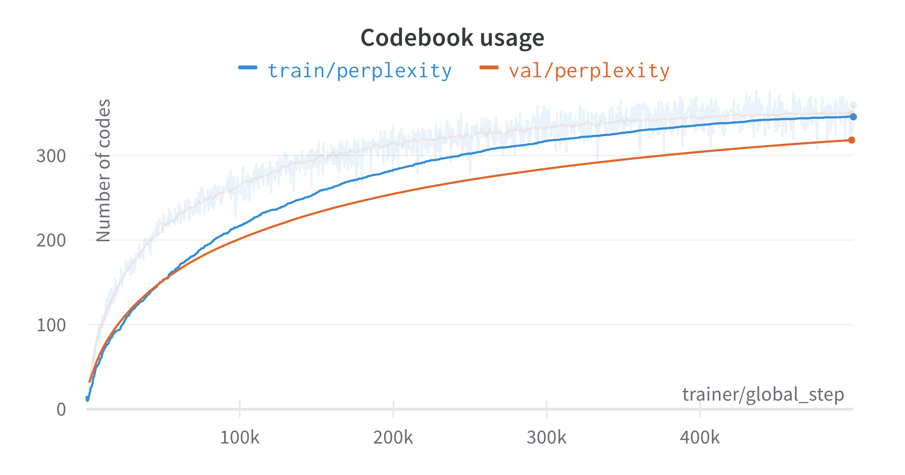

<p align="center">

  <h1 align="center">An unofficial PyTorch implementation of VQGAN</h1>
  <p align="center">
    <a href="https://twitter.com/khanhvu207"><strong>Khanh Vu</strong></a>
  </p>
  <p align="center"><strong>Department of Computer Science, ETH Zürich, Switzerland</strong></p>
  <div align="center"></div>
</p>
<br>

<div align="center">
    <div class="image-container">
        
        
        
        
        
        
        
        
    </div>
</div>

<div style="border: 1px solid #ccc; border-radius: 5px; padding: 10px;">
  <details open="open">
    <summary>Table of Contents</summary>
    <ol>
      <li><a href="#introduction">Introduction</a></li>
      <li><a href="#installation">Installation</a></li>
      <li><a href="#training">Training instruction</a></li>
      <li><a href="#insights">Insights</a></li>
    </ol>
  </details>
</div>

## Introduction
This repository feautres a concise and minimal implementation of [Taming Transformers for High-Resolution Image Synthesis](https://arxiv.org/abs/2012.09841), along with additional insights into the training dynamics of the codebook.

<div align="center">

</div>

The first-stage model is a symmetric autoencoder equipped with non-linear attentive blocks. It undergoes training with a mixed loss consisting of an $l_1$-reconstruction loss, perceptual LPIPS loss, and patch-wise GAN loss. The second-stage model is an autoregressive Transformers model designed to capture the discrete latent bottleneck of the first-stage model.

Regarding the quantization step, I implemented the vanilla vector quantizer from the [Neural Discrete Representation Learning](https://arxiv.org/abs/1711.00937) paper and also the exponential moving average (EMA) version.

Currently, I have limited computational resources, which restricts me to training on a small dataset such as FFHQ 256x256. 
Future training on larger datasets will be showcased.

## Installation

1. Create a new conda environment

```bash
$ cd vqgan
$ conda env create -f environment.yaml
```

2. Download the FFHQ dataset, create folder `src/data/ffhq` and put the data there.

3. Edit the `datasets/ffhq.py` to accommodate the dataset directory

```python
class FFHQ(Dataset):
    def __init__(self, root, train=True, transform=None):
        self.root = root
        self.image_dir = os.path.join(root, "<put the data directory here>")
```

## Training

To train the full VQGAN pipeline, run the following commands:

```bash
$ cd src
$ RUN_ID=<put your run_id> DEBUG=False make ffhq
```

The `DEBUG` flag can be optionally set to `True` for local debugging purposes. It will disable online logging and only run 10 training batches.

You can modify the config file `configs/ffhq_default.yaml` to adjust the hyperparameters and training specifications.

After the training finished, run the following command to generate synthetic images:
```bash
$ python sample.py --run_id=<your run_id> --config=configs/ffhq_default.yaml
```
<div align="center">
    <div style="display: flex; flex-direction: column; align-items: center;">
        
    </div>
</div>

## Insights

In this section, I will present my training statistics in an effort to illuminate the training challenges encountered with VQGAN.
The following plots report the quantitative training results.
While the losses are of usual apperances, it is obvious that the original VQGAN suffers from low codebook usage. 
The first-stage model only leverages around 380 codes out of 1024 codes.

<div align="center">
    <div class="image-container">
      
      
      
      
    </div>
</div>

To further shed light onto the codebook issue, I visualized the codebook gradients and code norms.

<div align="center">
    <div class="image-container">
        
        
        
    </div>
</div>

The top two plots in the first row indicate that only a small subset of codes receive non-zero gradients. Notably, the active codes within the codebook exhibit an increase in their norm throughout the training process. This trend is evident in both the third plot above and the time-series histogram plot below.

<div align="center">
    <div class="inline-block">
        
    </div>
</div>

## References

```
@article{DBLP:journals/corr/abs-2012-09841,
  author       = {Patrick Esser and
                  Robin Rombach and
                  Bj{\"{o}}rn Ommer},
  title        = {Taming Transformers for High-Resolution Image Synthesis},
  journal      = {CoRR},
  volume       = {abs/2012.09841},
  year         = {2020},
  url          = {https://arxiv.org/abs/2012.09841},
  eprinttype    = {arXiv},
  eprint       = {2012.09841},
  timestamp    = {Sun, 03 Jan 2021 18:46:06 +0100},
  biburl       = {https://dblp.org/rec/journals/corr/abs-2012-09841.bib},
  bibsource    = {dblp computer science bibliography, https://dblp.org}
}
```

```
@article{DBLP:journals/corr/abs-1711-00937,
  author       = {A{\"{a}}ron van den Oord and
                  Oriol Vinyals and
                  Koray Kavukcuoglu},
  title        = {Neural Discrete Representation Learning},
  journal      = {CoRR},
  volume       = {abs/1711.00937},
  year         = {2017},
  url          = {http://arxiv.org/abs/1711.00937},
  eprinttype    = {arXiv},
  eprint       = {1711.00937},
  timestamp    = {Mon, 13 Aug 2018 16:48:11 +0200},
  biburl       = {https://dblp.org/rec/journals/corr/abs-1711-00937.bib},
  bibsource    = {dblp computer science bibliography, https://dblp.org}
}
```
